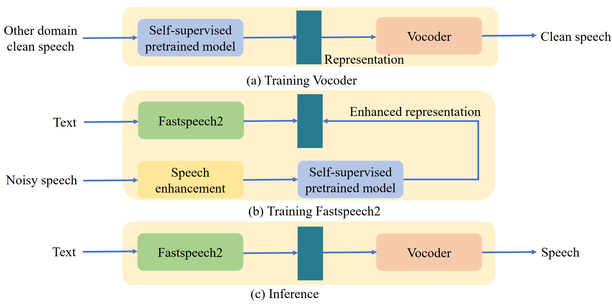

# 
 Rep2wav: Noise Robust TTS Using self-supervised representations 

## Abstract

 Benefiting from the development of deep learning, text-to-speech (TTS) technology using clean speech has now achieved significant performance improvements. 
The data collected from real scenes often contain noise and generally need to be denoised by speech enhancement models.	
Noise-robust TTS models are often trained using enhanced speech, which is susceptible to speech distortion and background noise, which can affect the quality of the synthesized speech. 
Meanwhile, the self-supervised pre-trained model exhibits excellent noise robustness on many speech tasks, and we conjecture that the representation has a better ability to tolerate noise perturbations. 
Therefore, we explore methods to improve the noise robustness of TTS models using pre-trained models. 
In this paper, based on the HIFI-GAN model we first propose the representation-to-waveform vocoder, which aims to learn to map the representation of the pre-trained model to the waveform. 
Second, based on the Fastspeech2 model we propose the text-to-representation Fastspeech2 model, which aims to learn to map text to pre-trained model representations. 
Finally, experimental results on the LJSpeech and LibriTTS datasets show that our method outperforms using speech enhancement methods in both subjective and objective metrics.

 

<body>

<h1>Ground Truth </h1>

<h3>
    <audio src="https://github.com/zqs01/rep2wav/raw/main/ground_truth/LJ005-0218.wav" controls="controls"></audio> 
    <audio src="https://github.com/zqs01/rep2wav/raw/main/ground_truth/LJ007-0143.wav" controls="controls"></audio> 
    <audio src="https://github.com/zqs01/rep2wav/raw/main/ground_truth/LJ008-0295.wav" controls="controls"></audio> 
    <audio src="https://github.com/zqs01/rep2wav/raw/main/ground_truth/LJ016-0027.wav" controls="controls"></audio> 
    <audio src="https://github.com/zqs01/rep2wav/raw/main/ground_truth/LJ019-0057.wav" controls="controls"></audio>
    <audio src="https://github.com/zqs01/rep2wav/raw/main/ground_truth/LJ029-0061.wav" controls="controls"></audio> 
    <audio src="https://github.com/zqs01/rep2wav/raw/main/ground_truth/LJ033-0170.wav" controls="controls"></audio> 
    <audio src="https://github.com/zqs01/rep2wav/raw/main/ground_truth/LJ035-0157.wav" controls="controls"></audio> 
    <audio src="https://github.com/zqs01/rep2wav/raw/main/ground_truth/LJ036-0163.wav" controls="controls"></audio> 
    <audio src="https://github.com/zqs01/rep2wav/raw/main/ground_truth/LJ040-0175.wav" controls="controls"></audio>
</h3>

 

<h1>Noisy speech </h1>

<h3>
    <audio src="https://github.com/zqs01/rep2wav/raw/main/noisy/LJ005-0218.wav" controls="controls"></audio> 
    <audio src="https://github.com/zqs01/rep2wav/raw/main/noisy/LJ007-0143.wav" controls="controls"></audio> 
    <audio src="https://github.com/zqs01/rep2wav/raw/main/noisy/LJ008-0295.wav" controls="controls"></audio> 
    <audio src="https://github.com/zqs01/rep2wav/raw/main/noisy/LJ016-0027.wav" controls="controls"></audio> 
    <audio src="https://github.com/zqs01/rep2wav/raw/main/noisy/LJ019-0057.wav" controls="controls"></audio>
    <audio src="https://github.com/zqs01/rep2wav/raw/main/noisy/LJ029-0061.wav" controls="controls"></audio> 
    <audio src="https://github.com/zqs01/rep2wav/raw/main/noisy/LJ033-0170.wav" controls="controls"></audio> 
    <audio src="https://github.com/zqs01/rep2wav/raw/main/noisy/LJ035-0157.wav" controls="controls"></audio> 
    <audio src="https://github.com/zqs01/rep2wav/raw/main/noisy/LJ036-0163.wav" controls="controls"></audio> 
    <audio src="https://github.com/zqs01/rep2wav/raw/main/noisy/LJ040-0175.wav" controls="controls"></audio>
</h3>

<h1>Enhanced speech </h1>

<h3>
    <audio src="https://github.com/zqs01/rep2wav/raw/main/enhanced/LJ005-0218.wav" controls="controls"></audio> 
    <audio src="https://github.com/zqs01/rep2wav/raw/main/enhanced/LJ007-0143.wav" controls="controls"></audio> 
    <audio src="https://github.com/zqs01/rep2wav/raw/main/enhanced/LJ008-0295.wav" controls="controls"></audio> 
    <audio src="https://github.com/zqs01/rep2wav/raw/main/enhanced/LJ016-0027.wav" controls="controls"></audio> 
    <audio src="https://github.com/zqs01/rep2wav/raw/main/enhanced/LJ019-0057.wav" controls="controls"></audio>
    <audio src="https://github.com/zqs01/rep2wav/raw/main/enhanced/LJ029-0061.wav" controls="controls"></audio> 
    <audio src="https://github.com/zqs01/rep2wav/raw/main/enhanced/LJ033-0170.wav" controls="controls"></audio> 
    <audio src="https://github.com/zqs01/rep2wav/raw/main/enhanced/LJ035-0157.wav" controls="controls"></audio> 
    <audio src="https://github.com/zqs01/rep2wav/raw/main/enhanced/LJ036-0163.wav" controls="controls"></audio> 
    <audio src="https://github.com/zqs01/rep2wav/raw/main/enhanced/LJ040-0175.wav" controls="controls"></audio>
</h3>

<h1>Fastspeech2 (using clean speech)</h1>
<h2>text2mel2wav (mel)</h2>

<h3>
    <audio src="https://github.com/zqs01/rep2wav/raw/main/Fastspeech_v2/LJ005-0218.wav" controls="controls"></audio> 
    <audio src="https://github.com/zqs01/rep2wav/raw/main/Fastspeech_v2/LJ007-0143.wav" controls="controls"></audio> 
    <audio src="https://github.com/zqs01/rep2wav/raw/main/Fastspeech_v2/LJ008-0295.wav" controls="controls"></audio> 
    <audio src="https://github.com/zqs01/rep2wav/raw/main/Fastspeech_v2/LJ016-0027.wav" controls="controls"></audio> 
    <audio src="https://github.com/zqs01/rep2wav/raw/main/Fastspeech_v2/LJ019-0057.wav" controls="controls"></audio>
    <audio src="https://github.com/zqs01/rep2wav/raw/main/Fastspeech_v2/LJ029-0061.wav" controls="controls"></audio> 
    <audio src="https://github.com/zqs01/rep2wav/raw/main/Fastspeech_v2/LJ033-0170.wav" controls="controls"></audio> 
    <audio src="https://github.com/zqs01/rep2wav/raw/main/Fastspeech_v2/LJ035-0157.wav" controls="controls"></audio> 
    <audio src="https://github.com/zqs01/rep2wav/raw/main/Fastspeech_v2/LJ036-0163.wav" controls="controls"></audio> 
    <audio src="https://github.com/zqs01/rep2wav/raw/main/Fastspeech_v2/LJ040-0175.wav" controls="controls"></audio>
</h3>

 

<h1>Fastspeech2 (using enhanced speech)</h1>
<h2>text2mel2wav (mel)</h2>

<h3>
    <audio src="https://github.com/zqs01/rep2wav/raw/main/FastSpeech2_v2_enh/LJ005-0218.wav" controls="controls"></audio> 
    <audio src="https://github.com/zqs01/rep2wav/raw/main/FastSpeech2_v2_enh/LJ007-0143.wav" controls="controls"></audio> 
    <audio src="https://github.com/zqs01/rep2wav/raw/main/FastSpeech2_v2_enh/LJ008-0295.wav" controls="controls"></audio> 
    <audio src="https://github.com/zqs01/rep2wav/raw/main/FastSpeech2_v2_enh/LJ016-0027.wav" controls="controls"></audio> 
    <audio src="https://github.com/zqs01/rep2wav/raw/main/FastSpeech2_v2_enh/LJ019-0057.wav" controls="controls"></audio>
    <audio src="https://github.com/zqs01/rep2wav/raw/main/FastSpeech2_v2_enh/LJ029-0061.wav" controls="controls"></audio> 
    <audio src="https://github.com/zqs01/rep2wav/raw/main/FastSpeech2_v2_enh/LJ033-0170.wav" controls="controls"></audio> 
    <audio src="https://github.com/zqs01/rep2wav/raw/main/FastSpeech2_v2_enh/LJ035-0157.wav" controls="controls"></audio> 
    <audio src="https://github.com/zqs01/rep2wav/raw/main/FastSpeech2_v2_enh/LJ036-0163.wav" controls="controls"></audio> 
    <audio src="https://github.com/zqs01/rep2wav/raw/main/FastSpeech2_v2_enh/LJ040-0175.wav" controls="controls"></audio>
</h3>

 

<h2>text2representation2wav (layer0)</h2>

<h3>
    <audio src="https://github.com/zqs01/rep2wav/raw/main/FastSpeech2_repre3_enh_layer0/LJ005-0218.wav" controls="controls"></audio> 
    <audio src="https://github.com/zqs01/rep2wav/raw/main/FastSpeech2_repre3_enh_layer0/LJ007-0143.wav" controls="controls"></audio> 
    <audio src="https://github.com/zqs01/rep2wav/raw/main/FastSpeech2_repre3_enh_layer0/LJ008-0295.wav" controls="controls"></audio> 
    <audio src="https://github.com/zqs01/rep2wav/raw/main/FastSpeech2_repre3_enh_layer0/LJ016-0027.wav" controls="controls"></audio> 
    <audio src="https://github.com/zqs01/rep2wav/raw/main/FastSpeech2_repre3_enh_layer0/LJ019-0057.wav" controls="controls"></audio>
    <audio src="https://github.com/zqs01/rep2wav/raw/main/FastSpeech2_repre3_enh_layer0/LJ029-0061.wav" controls="controls"></audio> 
    <audio src="https://github.com/zqs01/rep2wav/raw/main/FastSpeech2_repre3_enh_layer0/LJ033-0170.wav" controls="controls"></audio> 
    <audio src="https://github.com/zqs01/rep2wav/raw/main/FastSpeech2_repre3_enh_layer0/LJ035-0157.wav" controls="controls"></audio> 
    <audio src="https://github.com/zqs01/rep2wav/raw/main/FastSpeech2_repre3_enh_layer0/LJ036-0163.wav" controls="controls"></audio> 
    <audio src="https://github.com/zqs01/rep2wav/raw/main/FastSpeech2_repre3_enh_layer0/LJ040-0175.wav" controls="controls"></audio>
</h3>

 

<h2>text2representation2wav (layer1)</h2>

<h3>
    <audio src="https://github.com/zqs01/rep2wav/raw/main/FastSpeech2_repre3_enh_layer1/LJ005-0218.wav" controls="controls"></audio> 
    <audio src="https://github.com/zqs01/rep2wav/raw/main/FastSpeech2_repre3_enh_layer1/LJ007-0143.wav" controls="controls"></audio> 
    <audio src="https://github.com/zqs01/rep2wav/raw/main/FastSpeech2_repre3_enh_layer1/LJ008-0295.wav" controls="controls"></audio> 
    <audio src="https://github.com/zqs01/rep2wav/raw/main/FastSpeech2_repre3_enh_layer1/LJ016-0027.wav" controls="controls"></audio> 
    <audio src="https://github.com/zqs01/rep2wav/raw/main/FastSpeech2_repre3_enh_layer1/LJ019-0057.wav" controls="controls"></audio>
    <audio src="https://github.com/zqs01/rep2wav/raw/main/FastSpeech2_repre3_enh_layer1/LJ029-0061.wav" controls="controls"></audio> 
    <audio src="https://github.com/zqs01/rep2wav/raw/main/FastSpeech2_repre3_enh_layer1/LJ033-0170.wav" controls="controls"></audio> 
    <audio src="https://github.com/zqs01/rep2wav/raw/main/FastSpeech2_repre3_enh_layer1/LJ035-0157.wav" controls="controls"></audio> 
    <audio src="https://github.com/zqs01/rep2wav/raw/main/FastSpeech2_repre3_enh_layer1/LJ036-0163.wav" controls="controls"></audio> 
    <audio src="https://github.com/zqs01/rep2wav/raw/main/FastSpeech2_repre3_enh_layer1/LJ040-0175.wav" controls="controls"></audio>
</h3>

 

<h2>text2representation2wav (layer3)</h2>

<h3>
    <audio src="https://github.com/zqs01/rep2wav/raw/main/FastSpeech2_repre3_enh_layer3/LJ005-0218.wav" controls="controls"></audio> 
    <audio src="https://github.com/zqs01/rep2wav/raw/main/FastSpeech2_repre3_enh_layer3/LJ007-0143.wav" controls="controls"></audio> 
    <audio src="https://github.com/zqs01/rep2wav/raw/main/FastSpeech2_repre3_enh_layer3/LJ008-0295.wav" controls="controls"></audio> 
    <audio src="https://github.com/zqs01/rep2wav/raw/main/FastSpeech2_repre3_enh_layer3/LJ016-0027.wav" controls="controls"></audio> 
    <audio src="https://github.com/zqs01/rep2wav/raw/main/FastSpeech2_repre3_enh_layer3/LJ019-0057.wav" controls="controls"></audio>
    <audio src="https://github.com/zqs01/rep2wav/raw/main/FastSpeech2_repre3_enh_layer3/LJ029-0061.wav" controls="controls"></audio> 
    <audio src="https://github.com/zqs01/rep2wav/raw/main/FastSpeech2_repre3_enh_layer3/LJ033-0170.wav" controls="controls"></audio> 
    <audio src="https://github.com/zqs01/rep2wav/raw/main/FastSpeech2_repre3_enh_layer3/LJ035-0157.wav" controls="controls"></audio> 
    <audio src="https://github.com/zqs01/rep2wav/raw/main/FastSpeech2_repre3_enh_layer3/LJ036-0163.wav" controls="controls"></audio> 
    <audio src="https://github.com/zqs01/rep2wav/raw/main/FastSpeech2_repre3_enh_layer3/LJ040-0175.wav" controls="controls"></audio>
</h3>

 

<h2>text2representation2wav (layer5)</h2>

<h3>
    <audio src="https://github.com/zqs01/rep2wav/raw/main/FastSpeech2_repre3_enh_layer5/LJ005-0218.wav" controls="controls"></audio> 
    <audio src="https://github.com/zqs01/rep2wav/raw/main/FastSpeech2_repre3_enh_layer5/LJ007-0143.wav" controls="controls"></audio> 
    <audio src="https://github.com/zqs01/rep2wav/raw/main/FastSpeech2_repre3_enh_layer5/LJ008-0295.wav" controls="controls"></audio> 
    <audio src="https://github.com/zqs01/rep2wav/raw/main/FastSpeech2_repre3_enh_layer5/LJ016-0027.wav" controls="controls"></audio> 
    <audio src="https://github.com/zqs01/rep2wav/raw/main/FastSpeech2_repre3_enh_layer5/LJ019-0057.wav" controls="controls"></audio>
    <audio src="https://github.com/zqs01/rep2wav/raw/main/FastSpeech2_repre3_enh_layer5/LJ029-0061.wav" controls="controls"></audio> 
    <audio src="https://github.com/zqs01/rep2wav/raw/main/FastSpeech2_repre3_enh_layer5/LJ033-0170.wav" controls="controls"></audio> 
    <audio src="https://github.com/zqs01/rep2wav/raw/main/FastSpeech2_repre3_enh_layer5/LJ035-0157.wav" controls="controls"></audio> 
    <audio src="https://github.com/zqs01/rep2wav/raw/main/FastSpeech2_repre3_enh_layer5/LJ036-0163.wav" controls="controls"></audio> 
    <audio src="https://github.com/zqs01/rep2wav/raw/main/FastSpeech2_repre3_enh_layer5/LJ040-0175.wav" controls="controls"></audio>
</h3>

 

<h2>text2representation2wav (layer12)</h2>

<h3>
    <audio src="https://github.com/zqs01/rep2wav/raw/main/FastSpeech2_repre3_enh_layer12/LJ005-0218.wav" controls="controls"></audio> 
    <audio src="https://github.com/zqs01/rep2wav/raw/main/FastSpeech2_repre3_enh_layer12/LJ007-0143.wav" controls="controls"></audio> 
    <audio src="https://github.com/zqs01/rep2wav/raw/main/FastSpeech2_repre3_enh_layer12/LJ008-0295.wav" controls="controls"></audio> 
    <audio src="https://github.com/zqs01/rep2wav/raw/main/FastSpeech2_repre3_enh_layer12/LJ016-0027.wav" controls="controls"></audio> 
    <audio src="https://github.com/zqs01/rep2wav/raw/main/FastSpeech2_repre3_enh_layer12/LJ019-0057.wav" controls="controls"></audio>
    <audio src="https://github.com/zqs01/rep2wav/raw/main/FastSpeech2_repre3_enh_layer12/LJ029-0061.wav" controls="controls"></audio> 
    <audio src="https://github.com/zqs01/rep2wav/raw/main/FastSpeech2_repre3_enh_layer12/LJ033-0170.wav" controls="controls"></audio> 
    <audio src="https://github.com/zqs01/rep2wav/raw/main/FastSpeech2_repre3_enh_layer12/LJ035-0157.wav" controls="controls"></audio> 
    <audio src="https://github.com/zqs01/rep2wav/raw/main/FastSpeech2_repre3_enh_layer12/LJ036-0163.wav" controls="controls"></audio> 
    <audio src="https://github.com/zqs01/rep2wav/raw/main/FastSpeech2_repre3_enh_layer12/LJ040-0175.wav" controls="controls"></audio>
</h3>

 

<h2>text2representation2wav (layer weighted sum)</h2>

<h3>
    <audio src="https://github.com/zqs01/rep2wav/raw/main/FastSpeech2_repre3_enh_layer_weightsum/LJ005-0218.wav" controls="controls"></audio> 
    <audio src="https://github.com/zqs01/rep2wav/raw/main/FastSpeech2_repre3_enh_layer_weightsum/LJ007-0143.wav" controls="controls"></audio> 
    <audio src="https://github.com/zqs01/rep2wav/raw/main/FastSpeech2_repre3_enh_layer_weightsum/LJ008-0295.wav" controls="controls"></audio> 
    <audio src="https://github.com/zqs01/rep2wav/raw/main/FastSpeech2_repre3_enh_layer_weightsum/LJ016-0027.wav" controls="controls"></audio> 
    <audio src="https://github.com/zqs01/rep2wav/raw/main/FastSpeech2_repre3_enh_layer_weightsum/LJ019-0057.wav" controls="controls"></audio>
    <audio src="https://github.com/zqs01/rep2wav/raw/main/FastSpeech2_repre3_enh_layer_weightsum/LJ029-0061.wav" controls="controls"></audio> 
    <audio src="https://github.com/zqs01/rep2wav/raw/main/FastSpeech2_repre3_enh_layer_weightsum/LJ033-0170.wav" controls="controls"></audio> 
    <audio src="https://github.com/zqs01/rep2wav/raw/main/FastSpeech2_repre3_enh_layer_weightsum/LJ035-0157.wav" controls="controls"></audio> 
    <audio src="https://github.com/zqs01/rep2wav/raw/main/FastSpeech2_repre3_enh_layer_weightsum/LJ036-0163.wav" controls="controls"></audio> 
    <audio src="https://github.com/zqs01/rep2wav/raw/main/FastSpeech2_repre3_enh_layer_weightsum/LJ040-0175.wav" controls="controls"></audio>
</h3>

 

